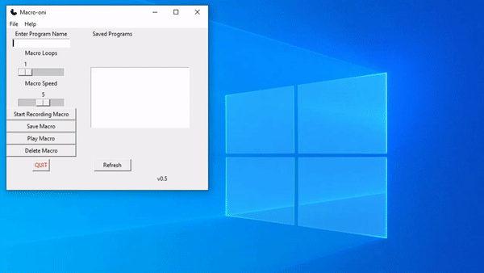

# Macro-oni
> Save your repetitive work tasks in Macro-oni and access them using an easy to use UI!

# Features
* Naming of your macro profiles.
* Easy speed control to change the speed of your macros.
* Ability to store as many profiles as you like.
* Delete unwanted profiles.

# How to Use
##### Create a macro
1. Enter a program name.
2. Hit "Start Recording Macro." All your mouse actions are now being recorded.
3. Once you are done, use **scrollwheel+click (any mouse button)** to break the loop.
4. Save your macro!
5. Done

##### Play a macro
1. Select a macro from the saved programs list on the right side of the program.
2. Select your macro play speed.
3. Now select "Play Macro"
4. If you decide you want to stop the macro, just move your mouse!

##### Delete a macro
1. Select a macro and click "Delete Macro"

# What's Next
* Full keyboard + mouse functionality.
* Ability to set a schedule to call your macros.

